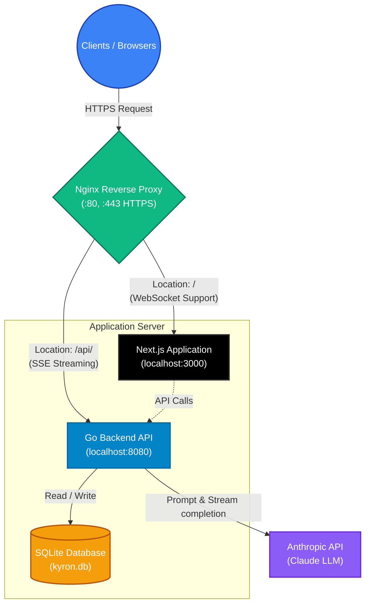

# Medical AI Agent

A full-stack, AI-powered medical conversational agent platform. This application provides a scalable environment for processing complex medical queries natively through the Anthropic Claude API, supported by a high-performance backend and a modern frontend interface.

## Architecture and Technology Stack

The application is built on a robust, service-oriented architecture designed to handle concurrent usage and structured streaming:

- **Frontend:** Next.js application (React) served dynamically via PM2.
- **Backend API:** High-performance Go service handling API requests and Server-Sent Events (SSE) streaming.
- **Database:** SQLite running in Write-Ahead Logging (WAL) mode for efficient local persistence.
- **Proxy/Routing:** Nginx reverse proxy managing SSL termination and traffic distribution between the frontend and backend.
- **AI Integration:** Direct integration with the Anthropic Claude large language model.



## Getting Started

### Prerequisites

- [Go](https://go.dev/doc/install) (1.20+)
- [Node.js](https://nodejs.org/) (18.x+)
- Anthropic API Key (`ANTHROPIC_API_KEY`)

### Backend Setup

1. Navigate to the backend directory and configure your environment:
   ```bash
   cd backend
   cp .env.example .env
   ```
2. Update `.env` with your API credentials. You must provide `ANTHROPIC_API_KEY` at a minimum.
3. Run the Go backend server:
   ```bash
   go run .
   ```

### Frontend Setup

1. In a separate terminal, navigate to the frontend directory:
   ```bash
   cd frontend
   ```
2. Set up the local environment to point to the backend API:
   ```bash
   echo "NEXT_PUBLIC_API_URL=http://localhost:8080" > .env.local
   ```
3. Install dependencies and start the development server:
   ```bash
   npm install
   npm run dev
   ```

## Production Deployment

This application is configured for production deployment using Nginx as a reverse proxy and PM2 for Node.js process management. Shell scripts (`deploy.sh`), systemd service files (`kyron-medical.service`), and PM2 ecosystem configurations (`ecosystem.config.js`) are included at the root for automated deployment workflows.